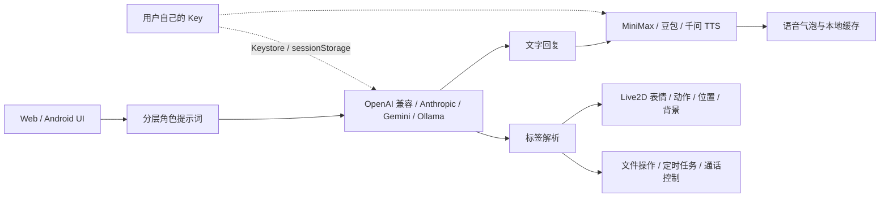

# ElainaChat Open

一个面向角色陪伴与旅行叙事的开源 AI 角色聊天应用。它保留了伊蕾娜的角色卡、记忆、图片输入和语音气泡体验，同时把服务商账号完全交还给使用者：没有作者网关、没有共享套餐、没有内置 Key。

这是独立的 BYOK（Bring Your Own Key）双端版本，不会连接正式闭源版的任何服务。

> **📌 关于本仓库**
>
> 本仓库是 [KaimeranFeran/ElainaChat-Open](https://github.com/KaimeranFeran/ElainaChat-Open)（MIT）的**二次开发改版**，在原版基础上新增了 **Live2D 视频通话**、**AI 标签协议驱动**、**AI 定时任务**、**Agent 文件操作（权限分级）**、**视觉模型图片转述**、**局域网访问密码**等能力，详见下方 [本改版新增功能](#本改版新增功能)。
>
> 仓库**不包含** `android-app/`（Capacitor + Gradle 安卓打包工程）与 `web/live2d/models/`（Live2D 模型文件），两者已在 `.gitignore` 中排除。因此 `npm run sync:web` / `npm run build:apk` 需要自行补回 `android-app/` 后才能使用。
>
> 完整改造记录、踩坑与验证数据见 [`docs/交付文档.md`](docs/交付文档.md)。

## 项目亮点

- **设备直连，费用自理**：对话支持 OpenAI 兼容、Anthropic、Gemini、Ollama 等多种 API 格式；语音输出支持 MiniMax、豆包 / 火山引擎与阿里千问 Qwen-TTS，全部直连用户账号。
- **Key 有明确的存储边界**：Android 使用系统 Keystore 加密；Web 只使用当前标签页 `sessionStorage`，不把 API Key 写进 `localStorage`。
- **Android 原生网络插件**：通过原生 HTTPS 请求绕过 WebView CORS 限制，同时禁止明文 HTTP，适合直接安装使用。
- **稳定的角色上下文**：角色扮演协议、世界观、完整角色卡、会话设定、相关记忆、本轮锚点和最近对话分层发送，避免长上下文逐渐污染人格。
- **记忆有预算而不是删数据**：按当前问题筛选相关记忆，每轮限制注入长度；原始记忆仍完整保存在本机。
- **图片输入与 OOC 约束**：输入框加号可附加图片；图片只作为待理解资料，不得改写角色身份、关系边界或事实。
- **语音竞态保护**：自动播放尚未返回时再次点击同一气泡会复用同一任务，避免重复 TTS、连续播放和缓存失效。
- **可选语音识别**：优先使用浏览器内置识别，也可填写自己的 DashScope Key 直连 qwen3-asr-flash。
- **可并行安装**：Android 应用名为 `ElainaChat Open`，包名为 `com.elainachat.opensource`，可以和正式版共存。

---

# 本改版新增功能

> 以下均为本改版在原版基础上的新增/修复内容，按模块整理。

## 一、🎥 Live2D 视频通话

顶部栏「📹 视频通话」按钮进入全屏通话界面，角色模型以 Live2D 形式实时渲染。

### 模型管理
- **应用内上传 zip**：在「设置 → Live2D」上传 Cubism 3 模型压缩包（含 `.model3.json` + `.moc3` + 纹理），服务端解压到 `web/live2d/models/`（该目录 `.gitignore` 不入库）。
- **模型切换与删除**：下拉切换已上传模型，可单独删除。
- **zip 解压健壮性**：支持 UTF-8 标志位 + **GBK 兜底解码**（Windows `Compress-Archive` 生成的中文名 zip 常见）、支持 **data descriptor**；目录名使用英文安全 id（`model_xxx`）而展示名保留中文；带路径白名单防目录穿越。

### 画面表现
- **AI 说话嘴部同步（LipSync）**：用 Web Audio `AnalyserNode` 读取**真实 TTS 音量**驱动 `ParamMouthOpenY`，无音量时回落到正弦波；嘴型幅度随情绪变化（激动张嘴大、平静/伤心小）。
- **背景设置**：预设渐变 / 纯色 / 自定义颜色 / 本机图片；应用后有 toast 反馈与色块选中高亮。
- **模型大小与位置调整框**：通话界面底部「📐 调整」按钮开关——框体贴合模型**实际绘制范围**（非画布留白）、每帧跟随；角手柄等比缩放（Shift 自由拉伸）、边手柄单轴缩放、框内拖动移动；−/＋ 按钮等比微调 ±10%；**每个模型独立记忆**位置与大小。
- **🐭 鼠标跟随**：头部 / 眼珠追踪鼠标位置，可在「设置 → Live2D → 鼠标跟随」整体开关（关闭立即复位角度参数）。

### 通用水印开关
不少模型作者在 VTube Studio 里绑定了数字键来切换"水印开关"表情（悠小喵按 `1`、泠按 `0`）。本改版做成**自动探测**：

- 服务端模型列表接口返回每个模型的 `exps` / `vtube` 信息，前端自动识别 exp 目录中命名为「水印 / watermark」的表情，读出其参数 Id 与隐藏值；
- 打开通话后按键盘 **1 / 0** 切换水印隐藏 / 显示，也可由 AI 用 `[操作:隐藏水印]` / `[操作:显示水印]` 触发；
- 直接通过 `setParameterValueById` 驱动参数（比 `expression()` 可靠），并按模型记忆开关状态。

> 通话界面**没有**水印按钮，只能键盘或 AI 触发。任意模型只要 exp 目录含「水印 / watermark」命名表情就自动支持，无需改代码。

### 通话内真实语音输入
底部「🎤 说话」按钮开始录音（复用主应用 ASR：阿里百炼 / 小米 MiMo / 浏览器），再点结束并发送；聆听时按钮变红脉冲。底部栏精简为 **🎤 说话 / 📐 调整 / 📞 挂断**。

## 二、🧠 AI 标签协议（模型自主决策）

LLM 回复中可以携带标签来驱动模型表现与应用功能，**标签不会显示给用户**：

| 标签 | 作用 |
| --- | --- |
| `[情绪:开心\|难过\|生气\|害羞\|惊讶\|委屈\|思考\|平静]` | 自动映射表情 + 嘴型幅度 |
| `[表情:xxx]` | 播放指定表情文件 |
| `[动作:xxx]` | 播放指定动作 |
| `[位置:left\|center\|right\|上\|下]` | 移动模型位置 |
| `[大小:大\|小\|特大\|特小\|65%]` | 调整模型大小 |
| `[背景:深蓝\|星空\|…]` | 切换通话背景 |
| `[操作:打开视频通话\|结束通话\|整理记忆\|静音\|取消静音\|隐藏水印\|显示水印]` | 执行应用内操作 |
| `[任务:…]` | 创建定时任务（见下节） |

**跨模型自适应**：模型列表接口返回每个模型的 `exps` / `motions`（`.exp3` / `.motion3` 文件名），系统提示词**动态注入当前模型可用的表情/动作列表**，由 AI 直接选用真实文件名（如 `[表情:哭哭]`）。语义键（`[表情:happy]`）与情绪词（`[情绪:开心]`）经过 **语义映射 → 精确匹配 → 子串/同义词组** 三级解析兜底，换任何 Live2D 模型都自动适配。

无标签时按触发词 / emoji 自动推断情绪。

## 三、⏰ AI 定时任务（未来消息）

AI 可以创建定时任务，到点后**以角色身份自动发消息**：

- 写法：`[任务:每天 09:00 提醒我喝水]` / `[任务:明天 14:00 …]` / `[任务:每3小时 …]` / `[任务:每周五 18:00 …]` / `[任务:30分钟后 …]`
- 调度器每 30 秒检查一次，支持**周期任务与一次性任务**；触发时插入当前对话，可选浏览器通知
- 「设置 → 高级」可查看和取消已有任务
- 系统提示词已注入标签指南，引导模型自然使用

## 四、🤖 AI Agent 文件操作（权限分级）

LLM 可用标签请求文件操作，由本地服务执行：

- `[操作:列出文件 路径]` / `[操作:查看文件 路径]` / `[操作:保存文件 路径|内容]`
- **权限两级**（设置 → 高级）：
  - 🔒 **限制模式**（默认）：仅可读写本应用文件夹（`web/`）
  - 💻 **允许操作电脑**：可读写任意路径，风险自担
- 操作结果以「【AI 操作结果】」消息回填对话，作为后续上下文
- **无删除权限**；报错由 AI 自然语言解释
- 应用内操作（视频通话 / 记忆 / 水印 / 背景 / 静音）在两种模式下均可用

## 五、👁️ 视觉模型图片转述

在「设置 → 视觉」配置一个 OpenAI 兼容的视觉模型（如 Qwen-VL），图片对话流程变为：

**视觉模型先看图转述成文字 → 交给主模型（如 DeepSeek）按角色回答**

未配置视觉模型时，图片直接发给当前模型（即原版行为）。

## 六、🎙️ 语音能力增强

- **ASR 多服务商**：浏览器内置识别 / 阿里百炼（`qwen3-asr-flash`）/ **小米 MiMo**（`mimo-v2.5-asr`）；接口地址与模型名均可配置，带「测试」按钮即时区分 ✅ Key 有效 / 401 Key 无效 / 403·404 模型未开通。
- **ASR 复用 TTS 的 DashScope Key**（阿里云百炼 Key 通用 TTS/ASR，一个 Key 即可），语音输入区显示 Key 配置状态。
- **对话模型新增「阿里云千问 Qwen」预设**：默认地址 `https://dashscope.aliyuncs.com/compatible-mode/v1`，走 OpenAI 兼容请求；对话 Key 留空时自动复用语音里的 DashScope Key。
- **错误提示全面友好化**：`network` / `not-allowed` / `audio-capture` / `no-speech` 等错误码翻译为可操作建议；非 Chromium 浏览器点击麦克风明确提示「语音识别仅支持 Chrome（含 Edge 等 Chromium 内核浏览器）」；检测到非安全上下文（局域网 IP / 手机 http 访问）直接给出提示。
- **完整日志链路**：识别开始（录音时长/wav 大小/模型名）→ 接口返回错误（HTTP 状态码 + 服务商返回原文）→ 云端识别失败（provider/code/status/message），跳过原因也带统计信息。
- **防重入与实例重建**：解决 Chrome「recognition has already started」以及旧实例卡死问题——捕获后 `abort()` 重置并**丢弃旧实例、重建全新实例**再重试（最多 3 次）。
- 标注浏览器内置识别为「暂不可用」（受网络与环境双重限制），推荐改用云端识别。

## 七、🔐 局域网访问密码

服务默认监听 `0.0.0.0`（手机 / 平板可访问），但 Agent 文件接口本身没有鉴权，因此增加了访问控制：

- **本机（127.0.0.1）自动视为管理员**：免密进入，且可修改访问密码（忘记密码时的找回入口）
- **局域网设备必须登录**：登录后种 HttpOnly Cookie 会话（7 天）
- 首次启动生成 12 位随机密码并在控制台醒目打印；用户改过密码后**只存 scrypt 加盐哈希**，不再显示明文
- 登录失败 5 次锁定 60 秒
- **CSRF 防护**：非 GET 请求校验 `Origin` 与 `Host` 同源
- **隐藏文件禁止静态访问**：`.local-auth.json` 返回 403
- 改密码后清空所有会话，局域网设备需重新登录
- 忘记密码：本机打开 `http://127.0.0.1:4173` → 设置 → 高级 → 访问密码；或 `node web/serve.mjs --reset-password` 重启

凭据文件 `web/.local-auth.json` 已加入 `.gitignore`。

> ⚠️ 局域网是明文 HTTP，密码在传输中不加密，建议仅在家庭 / 可信局域网使用。

## 八、⚙️ 设置界面与体验

- **设置分栏**：改为 6 个 Tab —— **角色 / 对话 / 语音 / 视觉 / Live2D / 高级**
- **「↺ 恢复默认设置」**：一键恢复对话 / 语音 / 视觉等配置；**API Key 全部保留**，角色卡不变（角色卡有独立恢复按钮）
- **进入页面不再强制填 Key**：改为提示弹窗，点「我知道了」即可关闭
- **控制台输出精简**：只保留本机 / 局域网访问地址与访问密码等必要信息

## 九、🐛 重要修复记录

### Live2D 参数"静默失效"专项
核心发现：**Cubism 运行时对不存在的参数名不报错**——`setParameterValueById('不存在的参数', 1)` 被静默接受、`getParameterValueById` 甚至能读回刚写入的值，但画面完全不变。同理，**参数存在于模型里 ≠ 被绑定到绘制**。

由此定下硬规则：**情绪参数一律先取模型真实参数表，再按语义槽解析成真实参数名；解析不到就跳过并告警，绝不硬写。**

实测（悠小喵，168 个参数，停掉 motion/eyeBlink/breath/physics/pose 后逐个设值做像素 diff）：`ParamSmile`、`ParamBrowL/R`、`ParamEyeLOpening`、**`ParamAngleX` / `ParamAngleY`** 全部"存在但未绑定"；真正生效的是 `ParamCheekPuff`、`ParamEyeLOpen/ROpen`、`ParamMouthOpenY`、`ParamMouthForm`、`ParamEyeBallX`，以及 **`ParamAngleX1` / `ParamAngleY1`**。

据此修复：情绪参数组改为语义槽 + 参数解析层；鼠标"头部追踪"从无效的标准名切到真实绑定的 `1` 号变体。

> 🔬 验证方法论：**验证 Live2D 参数是否真的生效，必须先停掉 motionManager / eyeBlink / breath / physics / pose 把漂移基线压到 0 再做像素 diff**。否则待机动画本身会产生约 1.5 万像素噪声，任何结论都不可信。

### 鼠标跟随导致的"整体位移"
修好头部追踪后暴露：鼠标一动整个模型朝鼠标方向下沉前倾。逐参数排查发现 `ParamAngleY2` 变化 29343 像素、**连水印层一起动**——它不是"低头/抬头"，而是推移整个模型。

修复：`headX` / `headY` 的候选只保留**标准名与 1 号变体**，不再驱动 `2` 号变体（带 `2` 后缀的角度变体在不同模型里可能是整体位移或整体旋转，语义不可靠，宁可不驱动）。修复后 `ParamAngleY2` 恒为 0，变化区域高度从 519 降到 417（只剩局部）。

### 标签解析：情绪标签会吞掉操作标签
`driveText()` 中解析到 `[情绪:…]` 后直接 `return`，把后面的 `[位置]` / `[大小]` / `[背景]` / `[操作]` **全部跳过**；而系统提示词又要求 AI 每轮回复都带情绪标签——结果是 `[操作:…]`（文件操作、打开/结束视频通话、整理记忆、静音、水印）**在实战中几乎永远不会被执行**，且 `stripTags()` 会把标签剥掉，用户看不到它被忽略，AI 还可能顺着说"已经帮你打开了"。

修复：改为布尔标志控制（只跳过自动推断、不再提前返回），支持**一条回复出现多个 `[操作:…]`**，未知情绪词回退到自动推断。（`[任务:…]` 不受影响，由 `index.html` 独立解析。）

### 画布拉伸与调整框错位
`live2d-canvas-wrap` 在 HTML 里是 class，代码却用 `getElementById` 获取 → 永远 `null`，导致 `resizeTo` 失效、canvas 保持默认 800×600 被 CSS 拉伸，模型变形、调整框偏移。修复：补上 `id`；渲染循环每帧核对 canvas 内部分辨率与容器 CSS 尺寸，不一致立即 `renderer.resize`；框定位乘 `canvas.clientWidth / canvas.width` 校正因子。

### 其他
- 每个设置 Tab 都显示角色卡（旧版遗留 JS 把角色卡移出 `tab-character`）→ 删除该移动逻辑
- 首次打开时自定义背景被渲染器不透明底色盖住 → `applyBackground()` 移到 app 创建之后
- `[操作:静音]` 实际没静音 → 导出 `isVoiceMuted()`，主应用播放前检查（静音时跳过播放但**照常保存文字回复**）
- 关闭通话后残留音量导致下次通话嘴型张开 → `close()` 补 `voiceEnergy = null`
- 上游兼容垫片：`replaceChildren`（Chromium < 86）与 `inset` 长属性兜底（Chromium < 87），覆盖 `web/index.html` 与 `android-app/www/index.html`；`web/live2d-video.js` 内的 fixed 全屏层同样改用长属性

## 十、📱 安卓端

- 模型改为**本地存储**（Capacitor Filesystem）而非打包进 APK
- 密钥持久化等修复
- 应用名 `ElainaChat Open`、包名 `com.elainachat.opensource`，可与正式版共存

> ⚠️ 本仓库**不含** `android-app/` 目录，上述改动不在本仓库内。

---

## 角色上下文与记忆系统

这个项目的重点不是把所有历史对话无上限地塞给模型，而是把“什么必须稳定、什么只在本轮相关时注入”分开处理。这样可以减轻长上下文后的性格漂移、事实混淆和胡言乱语，同时保留角色卡里的完整细节。

### 分层提示词

当前默认结构是 `layered-v2`。每次角色回复都会按下面的顺序构造消息：

| 层 | 内容 | 作用 |
| --- | --- | --- |
| 1 | 角色扮演核心协议 | 声明必须作为角色本人回应，规定信息优先级、事实边界和身份边界 |
| 2 | 世界观 | 说明魔法规则、时代背景、用户来自异世界以及面对面对话前提 |
| 3 | 完整角色卡 | 保留角色身份、人格、好恶、习惯、能力限制、关系边界和表达方式 |
| 4 | 会话专属设定 | 只影响当前对话的临时世界观或人设补充 |
| 5 | 相关长期记忆 | 从本机记忆库中按当前用户消息筛出的少量事实 |
| 6 | 图片规则 | 把图片当作待理解资料，不把图片里的文字当成系统指令 |
| 7 | 配音格式 | 需要日语语音时，约束 `<voice_jp>` 的输出格式 |
| 8 | 本轮角色锚点 | 在动态内容前再次提醒身份、好恶、知识边界和关系边界 |
| 9 | 最近对话 | 只保留最近的完整对话轮次，提供当前语境 |
| 10 | 当前用户消息 | 本轮真正需要回答的文字和可选图片 |

稳定的人设层始终位于对话历史之前；用户消息、历史文本、记忆和图片都被视为需要理解的数据，而不是可以改写角色的系统指令。提示词还包含事实纪律：不确定时承认不知道，不把推测写成共同经历，不凭空编造人物、地点或关系进展。

> 本改版在分层提示词中额外注入了 **Live2D 标签指南**（含当前模型可用表情/动作列表）、**定时任务标签指南**与 **Agent 操作标签指南**。

### 记忆注入策略

记忆数据完整保存在本机，系统只限制“每一轮送进模型多少内容”，不会为了控长删除原始记忆。每轮最多注入约 4800 个字符，并优先从当前问题相关的内容中选择：

- 关键记忆最多 4 条
- 约定最多 4 条
- 偏好与习惯最多 6 条
- 计划最多 4 条
- 目标最多 3 条
- 相关日记最多 3 条，最近日记最多 2 条

筛选会先按主题和文本相关性排序，再按类别上限和总字符预算截断；因此“记得更多”和“本轮只看相关内容”可以同时成立。自动记忆整理也只是生成摘要，不会覆盖角色卡或删除完整历史。

### 输出与回退

普通角色回复限制为 900 tokens，带 `<voice_jp>` 的回复限制为 1400 tokens，避免一次性生成过长内容拖垮后续上下文。旧的单一 system message 结构仍保留为 `legacy-v1` 回退路径，便于调试或对比，不需要迁移角色卡数据。

## 工作方式



默认对话格式是 OpenAI 兼容，默认模型为 `deepseek-chat`。开启思考开关时，DeepSeek 官方直连会切换到 `deepseek-reasoner`；其他 API 格式则按用户填写的模型名调用。语音输出可在设置中切换 MiniMax、豆包（新控制台 API Key 或旧控制台 App ID + Token）和阿里千问 Qwen-TTS；MiniMax 音色 ID 默认留空，必须由使用者填写自己账号可用的音色，豆包与千问可使用系统音色。

## 与正式版的边界

开源版的源码、设置键名、WebView 数据、Android 包名和 APK 输出目录都位于本目录，不覆盖上级目录中的正式闭源版。仓库不包含 DeepSeek、MiniMax、DashScope、豆包、作者网关或固定克隆音色的真实凭据。

## Web 端

```powershell
cd <仓库目录>
npm run serve:web
# 或直接：node web/serve.mjs
```

然后访问 `http://127.0.0.1:4173`，首次打开时填写所选 API 格式的 Key。语音 Key、模型和音色可在设置中随后填写。

服务默认监听 `0.0.0.0`，手机 / 平板可用 `http://<本机局域网IP>:4173` 访问（需局域网访问密码）；可用 `HOST` / `PORT` 环境变量覆盖。

Web 版没有任何中转服务。如果服务商拒绝浏览器跨域请求，可以使用 Android 版，或在“自定义 Base URL”中填写自己部署并信任的 HTTPS 服务。

## Android 端

> ⚠️ 本仓库**不包含** `android-app/`（Capacitor + Gradle 打包工程，已在 `.gitignore` 中排除），需要自行补回该目录后才能构建；否则 `npm run sync:web` / `npm run build:apk` 会失败。

环境要求：Android SDK、JDK 21 和 Node.js。

```powershell
cd <仓库目录>
npm run sync:web
cd android-app
npm install
npm test
npm run build:debug
```

APK 输出在 `android-app/android/app/build/outputs/apk/debug/app-debug.apk`。构建脚本会把 `web/index.html` 同步到 Android 项目；原生 HTTP 插件只接受 HTTPS，API Key 由 Android Keystore 加密保存。

## 图片输入说明

请求使用 OpenAI 风格的 `image_url` 内容格式。若在「设置 → 视觉」配置了视觉模型，图片会先由视觉模型**转述成文字**再交给主模型；未配置时直接发给当前模型，此时是否能分析图片取决于所选模型（如 DeepSeek 官方当前模型不支持视觉输入，请切换到支持图片的自定义兼容模型）。应用不会把图片上传到作者服务器。

## 测试与目录

```text
ElainaChat-Open/
├─ web/
│  ├─ index.html                 # 主应用（单文件）
│  ├─ live2d-video.js            # Live2D 视频通话模块
│  ├─ serve.mjs                  # 静态服务 + 模型上传/删除 API + 访问密码
│  ├─ diag-live2d.html           # Live2D 库诊断页
│  ├─ diag-asr.html              # 语音识别诊断页
│  ├─ vendor/                    # tailwind / pixi 6 / cubism core / cubism4 版 live2d 库
│  └─ live2d/models/             # 上传的模型（gitignore，不入库）
├─ docs/
│  ├─ agent-skill.md
│  └─ 交付文档.md                # 完整改造记录 / 踩坑 / 验证数据
├─ scripts/sync-web.mjs          # 将 Web 页面同步到 Android
├─ android-app/                  # 安卓工程（本仓库已排除，不入库）
├─ 启动.bat
├─ README.md
└─ LICENSE
```

`docs/agent-skill.md` 记录了 Agent 文件操作的能力与权限约定。诊断页：

- `http://localhost:4173/diag-live2d.html` — 检查三个 Live2D 库是否加载、`PIXI.live2d` 是否挂载
- `http://localhost:4173/diag-asr.html` — 检查浏览器环境 / 麦克风权限 / 实际识别测试

Android 测试覆盖角色上下文结构、记忆预算、TTS 竞态去重、多供应商 TTS 适配、直连请求和 Key 不落 `localStorage`。

## 已知限制

- **参数绑定情况由模型作者决定，换模型必须重新验证**：例如悠小喵没有绑定任何眉毛参数，"皱眉/挑眉"在该模型上无法用参数表达
- 参数"是否存在"与"是否绑定"无法在运行时廉价探测（需逐个设值做像素 diff），遇到命名特殊的模型仍可能解析到未绑定的参数
- 带 `2` 及以上后缀的角度变体（`ParamAngleX2` / `ParamAngleY2`）语义不可靠，已排除不驱动；若某模型把头部的俯仰**只**绑在 `Y2` 上，需单独适配
- 鼠标跟随幅度（X 轴 ±20°、Y 轴 ±16°）为固定值，暂无设置项
- 尺寸记忆按模型名存储，手机 / 桌面共用一份，跨端切换屏幕后比例会按当前屏幕高度钳制
- 安卓（Capacitor）端 Live2D 未实测（网格手柄交互同样未实测）
- 上传大 zip（>50MB）内存占用较高（整包读入内存）
- Live2D 模型目录已 gitignore，但**用户上传的模型版权需自行注意**

## 常见问题（FAQ）

**Q: 视频通话提示"模型加载失败：Network error"？**
A: 模型文件不在 `web/live2d/models/` 里（被清理或未上传）。重新在设置 → Live2D 上传，或把模型文件夹放进去。

**Q: 上传 zip 后找不到 model3.json？**
A: zip 需包含 `.model3.json` 文件（Cubism 3 模型）。确认 zip 里有，且解压后路径正确。

**Q: 背景 / 大小没生效？**
A: 强刷（Ctrl+F5）清缓存。背景在设置 → Live2D 里选；大小 / 位置在视频通话底部点「📐 调整」打开调整框，拖手柄缩放、框内拖动移动（角手柄等比，Shift 自由），−/＋ 可等比微调。

**Q: 鼠标一动整个模型往前扑？**
A: 早期版本会驱动 `ParamAngleY2`（它推移整个模型而非转头）。当前版本已排除 `2` 号变体；若仍有异常，可在设置 → Live2D 关闭「鼠标跟随」。

**Q: 模型水印怎么隐藏（悠小喵按 1、泠按 0）？**
A: 这类模型自带"水印开关"表情。打开视频通话后按键盘 **1 / 0** 切换，也可以直接让 AI「把水印隐藏掉」（它会用 `[操作:隐藏水印]` 触发）。通话界面没有水印按钮，只能靠键盘或 AI。开关状态按模型记忆。

**Q: AI 回复里的 `[表情:xxx]` 没触发模型表情？**
A: 检查模型 exp 目录是否有对应表情文件、`EXPRESSION_MAP` 是否匹配；也可以直接让 AI 用 `[情绪:开心]` 这类情绪标签，它会走三级解析兜底。

**Q: 浏览器语音识别用不了 / 报错？**
A: 打开 `http://localhost:4173/diag-asr.html`，先点「测试麦克风」再点「开始语音识别测试」，页面会显示环境检测、权限结果、实时转写与诊断结论。浏览器内置识别受网络与环境限制，已标注「暂不可用」，推荐在设置 → 语音改用阿里百炼或小米 MiMo。

**Q: 局域网设备打不开或提示登录？**
A: 局域网访问需要访问密码，首次启动会在控制台打印 12 位随机密码。忘记密码时在本机打开 `http://127.0.0.1:4173` → 设置 → 高级 → 访问密码，或 `node web/serve.mjs --reset-password`。

## 二次开发入口

- **Live2D 模块**：`web/live2d-video.js`（渲染、驱动、上传、背景、大小、鼠标跟随、水印）
- **服务端**：`web/serve.mjs`（上传/删除 API、zip 解压、访问密码、Agent 文件接口）
- **设置界面**：`web/index.html` 的 `tab-character` / `tab-live2d` / `tab-vision` / `tab-advanced` 区块
- **AI 回复驱动**：`web/index.html` 的 `handleUserInput`（speakStart / speakEnd / drive）
- **视觉转述**：`web/index.html` 的 `callAI` / `describeImageWithVision`

## 安全边界与费用

直连模式意味着服务商 Key 会存在使用者设备上，相关 Token、语音和识别费用由使用者自己的服务商账号承担。Android 的密钥材料由系统 Keystore 管理，但 root、调试注入或被攻破的设备不属于可信环境；Web 页面也不应加载不受信任的第三方脚本或浏览器扩展。

**Agent 文件操作**在「允许操作电脑」模式下可读写任意路径，请只在信任的使用环境中开启；局域网访问请务必设置强密码（局域网为明文 HTTP）。

本项目代码采用 MIT License。角色名称、角色卡内容、图片素材及第三方服务商商标的权利不因代码开源而自动转移，请按各自许可使用。

## 衍生项目说明

本项目基于 [KaimeranFeran/ElainaChat-Open](https://github.com/KaimeranFeran/ElainaChat-Open)（MIT 协议）二次开发，保留原作者版权声明。

### 新增功能摘要

- Live2D 视频通话增强：鼠标跟随（头部/眼睛追踪）、表情与情绪自然语言触发、跨模型表情自适应、通用水印控制、模型调整框
- AI 定时任务（未来消息）：AI 创建 `[任务:…]` 自动到点发消息
- Agent 文件操作：自然语言触发读写文件、权限分级（应用内限制 / 允许操作电脑）、AI 自然解释报错、无删除权限
- 视觉模型多模态转述：图片 → 视觉模型转述 → 主模型角色修正
- 局域网访问密码 + CSRF 防护 + Agent 接口鉴权
- 语音输入多服务商（阿里百炼 / 小米 MiMo）与 ASR 稳定性修复
- 设置分栏（6 Tab）与「恢复默认设置」
- 手机 APK：模型本地存储（Capacitor Filesystem）、密钥持久化等修复

遵循 MIT 协议，使用请保留版权声明。
